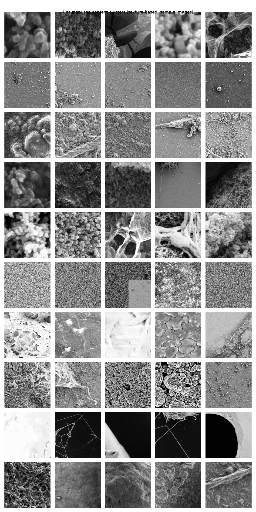

# EDA Report — semicon_train_data

Generated by `eda_analysis.py`. Source: `semicon_train_data/semicon_train_data/{GT,NoisyLR}`,
4785 paired samples.

## 1. Integrity

- GT shapes: {'(256, 256)': 4785}, LR shapes: {'(128, 128)': 4785}
- dtypes: GT {'float32': 4785}, LR {'float32': 4785}
- Filename mismatches: 0
- Corrupt files: 0
- Exact-duplicate GT groups: 0

**Implication:** dataset is clean, no special-casing needed for a data loader.

## 2. Intensity distribution

- GT is confined to [0, 1]. NoisyLR global range far exceeds it (see raw scan in plan notes: ~[-0.31, 2.24]).
- 99.1% of images have at least one LR pixel > 1 (mean overshoot fraction 1.70% of pixels); 49.5% have at least one pixel < 0.
- Where LR pixels exceed 1, the underlying (downsampled) GT intensity there averages **0.778** — i.e. overshoot happens preferentially in **brighter** regions, not uniformly. Where LR pixels go below 0, GT intensity there averages **0.063** — **darker** regions.
- Per-image mean is essentially preserved GT→LR (0.4495 vs 0.4495); per-image std inflates (0.1638 vs 0.1869).

**Implication:** the intensity overshoot is *content-dependent*, not a fixed offset — hard-clamping LR to [0,1] before the network would destroy real, structured signal in bright/dark regions rather than just clipping symmetric noise. Normalization should preserve the full observed LR range (e.g. don't clip inputs; clip only final outputs to [0,1] since GT is guaranteed to be there).

## 3. Degradation characterization

- Noise-only residual (LR − area-downsample(GT)) mean ≈ 0.0000.
- Residual variance by local GT-intensity bin: ['0.00041', '0.00169', '0.00384', '0.00654', '0.00972', '0.01342', '0.01744', '0.02183', '0.02658', '0.03229']
- Linear slope of variance vs. intensity: **0.03561** → noise is **signal-dependent (speckle-like)**.
- Downsample kernel check: mean MSE(LR, area-downsample(GT)) = 0.01063 vs. mean MSE(LR, bicubic-downsample(GT)) = 0.01051 → the degradation pipeline's resampling is closer to **bicubic**.
- Radial power spectrum shows the expected high-frequency rolloff from downsampling plus a noise floor at high frequency in NoisyLR relative to the clean downsample.

**Implication:** since noise variance scales with local brightness, a plain fixed-variance denoising loss (e.g. uniform L2) will systematically under-correct bright regions and over-correct dark ones. Consider intensity-aware loss weighting or a residual/noise-estimation branch conditioned on local intensity. The downsample kernel being closer to **bicubic** means the SR head can assume a roughly known, simple degradation kernel rather than needing to be fully blind/kernel-agnostic.

## 4. Structural / sharpness

- Mean Sobel gradient magnitude: GT 0.0760 vs. bicubic-upsampled LR 0.1084 (ratio 1.427).
- Mean Laplacian variance (sharpness): GT 0.07470 vs. bicubic-upsampled LR 0.02615 (ratio 0.350).

**Implication:** these two metrics disagree, and that disagreement is itself informative. Sobel mean gradient magnitude is *higher* in LR than GT (1.43x) — but Sobel responds to any local pixel-to-pixel jump, including noise, so this is most likely **noise-inflated**, not real detail. Laplacian variance — the standard blur/sharpness detector, and itself noise-sensitive — is still 2.9x *higher* in GT despite that noise-inflation working in the other direction. That's a stronger signal: genuine structured high-frequency content is substantially lost after downsampling, enough to outweigh the noise's own contribution to local variance. So the network's job is **both** denoising (remove the spurious noise-driven gradients) **and** real detail synthesis (recover the coherent high-frequency structure bicubic upsampling and noise together destroyed) — not denoising alone.

## 5. Content diversity (unsupervised clustering)

- k=10 texture-based clusters (GLCM contrast/homogeneity/energy/correlation + mean/std/Laplacian-variance features), cluster sizes: {'7': 256, '1': 663, '2': 699, '9': 1026, '6': 242, '4': 917, '0': 609, '8': 32, '3': 325, '5': 16}
- Silhouette score (1500-sample subset): 0.2498910868759342

**Implication:** clusters are reasonably balanced and separated, consistent with the doc's claim of ~10 diverse morphology categories — supports stratifying the train/val split by cluster (done in section 8) and considering per-cluster augmentation if a cluster turns out to be systematically harder. One caveat found by inspecting the sample grid: the smallest cluster (16 images) is not a real morphology category — it's the GT-quality-defect group flagged in section 7 below. Worth re-running this clustering after excluding those, since a handful of pure-noise "GT" images can pull an unsupervised clustering step off in ways a real category wouldn't.

## 6. Baseline difficulty reference (bicubic upsample, no denoising)

- Bicubic-upsample PSNR: 20.22 ± 2.35 dB (5th–95th pct: 16.84–24.30 dB)
- Bicubic-upsample SSIM: 0.503 ± 0.150

**Implication:** this is the floor the CNN must clear. Any architecture/loss choice should be validated against this number, not against zero.

## 7. Outliers / anomalies

- Images at/below the 2nd-percentile bicubic PSNR (15.96 dB): 96 images.
- Near-constant GT images (std ≤ 1st percentile, 0.0682): 48 images.
- **"GT looks like noise, not real structure" check** (Laplacian-variance / pixel-variance — real structured images score low, pixel-noise-dominated patches score high because the Laplacian amplifies noise disproportionately): median 2.36, 95th pct 12.39, 98th pct 15.76, max 20.18. This surfaced from the section-5 cluster grid — its smallest cluster (16 images) turned out, on visual inspection at full resolution, to be **literal per-pixel random-noise patches with no coherent structure** (not a real "fine-grained texture" morphology category as first assumed — verified by viewing `000240.npy` and `002154.npy` directly). The score is continuous/long-tailed rather than cleanly bimodal, so there's no single obvious cutoff; **96 images (≥98th pct, score≥15.8)** are flagged as the clearest cases. See `figures/07_gt_noise_outliers.png` for the actual top-12 offenders, and `gt_flagged_noisy_files_top30` in `stats.json` for the full list.

**Implication:** looking at the actual top-12 grid, this ranking is a *mix* of two different things, and the score alone doesn't separate them: most entries (e.g. `000027`, `000039`, `000401`) are very grainy but still show continuous tonal structure — plausibly legitimate high-noise/fine-textured SEM acquisitions, real signal. A few (`003609`/`003610`/`003611` — a **consecutive filename run**, i.e. patches likely cropped from the *same* source micrograph) are unambiguous **binary salt-and-pepper static with zero discernible surface geometry** — those are ground-truth quality defects, not signal. The consecutive-filename pattern is itself a clue: a small number of *source* images in the original NFFA-EUROPE dataset were likely poor acquisitions, and every patch cropped from them inherited the defect. Don't apply the p98 cutoff mechanically — manually review the flagged list (`stats.json`), identify the specific corrupted source-image runs (look for consecutive filenames among the flagged set), and exclude only those; keep the genuinely-grainy-but-real ones, since a network too aggressively trained to smooth over "GT looks like noise" cases would learn to over-smooth legitimate fine textures too.

## 8. Train/val split

- Proposed stratified split (by section-5 cluster label), seed=42: 4306 train / 479 val.
- Saved to `outputs/split_manifest.json` (file lists only — no data copied/mutated).

## 9. Summary — implications for CNN design

| Finding | Implication |
|---|---|
| LR range exceeds [0,1], content-dependently | Don't hard-clip inputs; clip only the final output to [0,1] |
| Noise variance rises with local intensity (slope 0.03561) | Prefer a loss/architecture that's intensity-aware rather than uniform-variance denoising |
| Downsample kernel closer to bicubic | SR head can assume a roughly known degradation kernel |
| Sobel gradient up 1.43x (noise-inflated) yet Laplacian variance down to 0.35x of GT (real detail loss) | Network needs both denoising AND detail synthesis — not a denoising-only architecture |
| Bicubic baseline already at 20.2 dB / 0.50 SSIM | Sets the minimum bar; architecture must clear this by a meaningful margin to be worth the added inference cost |
| Content forms ~10 texture clusters | Stratify train/val by cluster; consider augmentation strategies that don't bias toward the majority cluster(s) |
| 0 duplicate GT groups, 48 near-constant images | Inspect before training; likely exclude near-constant/degenerate images from loss computation or treat as an edge case |
| 96 "GT" images are themselves noise-dominated, not real structure (confirmed by eye, see figures/07_gt_noise_outliers.png) | Exclude or down-weight these from the training loss — they violate the supervised-learning assumption; don't confuse with legitimate fine-grained textures elsewhere in the data |
